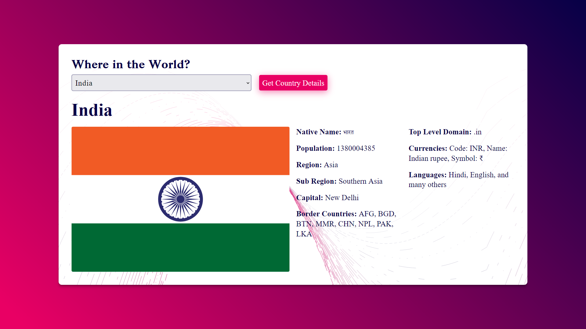

# Country Details Project

## Project Overview

The Countries Project is a web application that displays information about different countries. It aims to provide users with easy access to country data, including population, area, and other relevant details. The project leverages Node.js, Express, EJS for server-side rendering, and PostgreSQL for the database.

### Key Features
- Display country information
- Search for countries
- Responsive design

### Technologies Used
- Node.js
- Express
- EJS
- PostgreSQL
- CSS

## Table of Contents
- [Country Details Project](#country-details-project)
  - [Project Overview](#project-overview)
    - [Key Features](#key-features)
    - [Technologies Used](#technologies-used)
  - [Table of Contents](#table-of-contents)
  - [Installation Instructions](#installation-instructions)
  - [Usage Examples](#usage-examples)
    - [Screenshots](#screenshots)
  - [Contribution Guidelines](#contribution-guidelines)
  - [Acknowledgments](#acknowledgments)
  - [Contact Information](#contact-information)

## Installation Instructions

1. Clone the repository:
    ```sh
    git clone https://github.com/Rajiv-0920/Country-Details-Project 
    ```
2. Navigate to the project directory:
    ```sh
    cd countries
    ```
3. Install the dependencies:
    ```sh
    npm install
    ```
4. Set up the PostgreSQL database:
    - Ensure PostgreSQL is installed and running.
    - Create a database named `world`.
    - Create a `.env` file in the root directory and add your PostgreSQL connection string:
        ```env
        DB_USER="user"
        DB_DATABASE="world"
        DB_PASSWORD="password"
        DB_HOST="localhost"
        ```
    - **Import data from CSV (Optional):**
        - Place the `countries.csv` file in a known location.
        - Use the `psql` command-line tool or a GUI tool like pgAdmin to import the data.
        - Example using `psql`:
            ```sh
            psql -d world -c "\copy countries FROM 'path/to/countries.csv' DELIMITER ',' CSV HEADER;"
            ```
            Replace `'path/to/countries.csv'` with the actual path to your CSV file.  Make sure the `countries` table exists and its columns match the CSV structure.

## Usage Examples

1. Start the server:
    ```sh
    npm start
    ```
2. Open your browser and navigate to `http://localhost:3000`.

### Screenshots


## Contribution Guidelines

We welcome contributions! Please follow these steps to contribute:

1. Fork the repository.
2. Create a new branch:
    ```sh
    git checkout -b feature-branch
    ```
3. Make your changes and commit them:
    ```sh
    git commit -m "Description of changes"
    ```
4. Push to the branch:
    ```sh
    git push origin feature-branch
    ```
5. Open a pull request.

## Acknowledgments

- [Node.js](https://nodejs.org/)
- [Express](https://expressjs.com/)
- [EJS](https://ejs.co/)
- [PostgreSQL](https://www.postgresql.org/)

## Contact Information

For questions or feedback, please reach out to:

- Email: kumarrajiv0920@gmail.com
- GitHub: [My GitHub Profile](https://github.com/rajiv-0920)
- LinkedIn: [Connect with me on LinkedIn](https://www.linkedin.com/in/rajiv4373)
